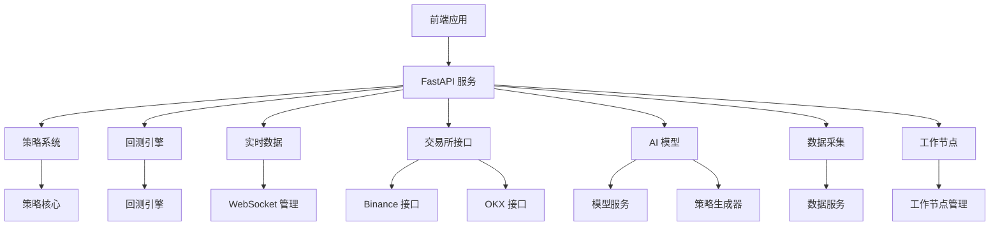

# QuantCell 项目 Code Wiki

## 1. 项目概述

QuantCell 是一个功能完整的量化交易系统，集成了策略开发、回测、实盘交易和AI辅助功能。系统采用前后端分离架构，后端基于 FastAPI 构建，前端使用 React + TypeScript 开发。

### 1.1 核心功能

- **策略开发与管理**：提供策略基类和多种执行引擎，支持事件驱动和向量式回测
- **高性能回测**：基于 nautilus_trader 框架的事件驱动回测引擎
- **实时数据处理**：支持实时市场数据订阅和处理
- **交易所连接**：支持 Binance、OKX 等交易所的接口
- **AI 辅助功能**：集成 AI 模型，支持策略生成和优化
- **完整的前端界面**：提供策略管理、回测分析、实时监控等功能

### 1.2 技术栈

| 类别 | 技术/框架 | 用途 |
|------|----------|------|
| 后端 | Python 3.10+ | 核心业务逻辑 |
| 后端框架 | FastAPI | API 服务 |
| 数据库 | SQLite/PostgreSQL | 数据存储 |
| 前端 | React 18+ | 用户界面 |
| 前端语言 | TypeScript | 类型安全 |
| 前端框架 | Ant Design | UI 组件库 |
| 包管理 | uv (后端) / bun (前端) | 依赖管理 |
| 回测引擎 | nautilus_trader | 高性能回测 |

## 2. 项目架构

### 2.1 整体架构

QuantCell 采用分层架构设计，清晰分离各个功能模块，便于维护和扩展。



### 2.2 目录结构

```
QuantCell/
├── backend/              # 后端代码
│   ├── agent/            # 智能代理模块
│   ├── ai_model/         # AI 模型相关功能
│   ├── backtest/         # 回测系统
│   ├── collector/        # 数据采集模块
│   ├── common/           # 通用组件
│   ├── core/             # 核心功能
│   ├── exchange/         # 交易所接口
│   ├── factor/           # 因子分析
│   ├── indicators/       # 技术指标
│   ├── realtime/         # 实时数据处理
│   ├── strategy/         # 策略系统
│   ├── tests/            # 测试代码
│   ├── utils/            # 工具函数
│   ├── main.py           # 应用入口
│   └── pyproject.toml    # 项目配置
├── frontend/             # 前端代码
│   ├── public/           # 静态资源
│   ├── src/              # 源代码
│   │   ├── api/          # API 调用
│   │   ├── components/   # 组件
│   │   ├── pages/        # 页面
│   │   ├── router/       # 路由
│   │   ├── services/     # 服务
│   │   └── store/        # 状态管理
│   ├── package.json      # 前端依赖
│   └── vite.config.ts    # Vite 配置
└── README.md             # 项目说明
```

## 3. 核心模块详解

### 3.1 策略系统

策略系统是 QuantCell 的核心功能，提供了策略开发、执行和管理的完整框架。

#### 3.1.1 策略基类

策略基类 `StrategyBase` 定义了策略的基本接口和生命周期方法，所有策略都需要继承此类并实现相应的方法。

**核心文件**：[strategy/core/strategy.py](file:///Users/liupeng/workspace/quant/QuantCell/backend/strategy/core/strategy.py)

**主要方法**：
- `on_start()`: 策略启动时调用，用于初始化策略状态
- `on_bar()`: 收到K线数据时调用，实现核心交易逻辑
- `on_stop()`: 策略停止时调用，用于清理资源

**交易接口**：
- `buy()`: 买入下单
- `sell()`: 卖出下单
- `close_position()`: 平仓
- `cancel_order()`: 取消订单

#### 3.1.2 策略执行引擎

策略系统支持多种执行引擎，包括：

- **事件驱动引擎**：基于事件的回测和实盘执行
- **向量引擎**：基于向量化计算的高性能回测
- **Numba 优化引擎**：使用 Numba 加速的高性能回测

### 3.2 回测系统

回测系统提供了高性能的策略回测功能，支持多种回测引擎和结果分析。

#### 3.2.1 回测引擎

**核心文件**：[backtest/engines/engine.py](file:///Users/liupeng/workspace/quant/QuantCell/backend/backtest/engines/engine.py)

**主要功能**：
- 基于 nautilus_trader 的事件驱动回测
- 支持多品种、多策略回测
- 提供详细的回测结果分析
- 支持自定义数据来源

**使用流程**：
1. 初始化回测引擎
2. 配置回测参数（初始资金、时间范围、交易品种等）
3. 运行回测
4. 分析回测结果

### 3.3 实时数据处理

实时数据处理模块负责从交易所获取实时市场数据，并分发给策略和前端。

**核心功能**：
- WebSocket 连接管理
- 实时 K 线数据处理
- 数据分发和订阅
- 数据持久化

### 3.4 交易所接口

交易所接口模块提供了与不同交易所的连接和交互功能。

**支持的交易所**：
- Binance
- OKX

**主要功能**：
- 市场数据获取
- 订单操作
- 账户信息查询
- 交易执行

### 3.5 AI 辅助功能

AI 辅助功能模块集成了 AI 模型，用于策略生成、优化和分析。

**核心功能**：
- 策略生成
- 策略优化
- 技术分析
- 市场情绪分析

## 4. 前端系统

前端系统使用 React + TypeScript 构建，提供了直观的用户界面，用于策略管理、回测分析和系统监控。

### 4.1 前端架构

**核心文件**：[frontend/src/App.tsx](file:///Users/liupeng/workspace/quant/QuantCell/frontend/src/App.tsx)

**主要模块**：
- 策略管理：创建、编辑、测试策略
- 回测分析：配置回测参数，查看回测结果
- 数据管理：管理市场数据和历史数据
- 实时监控：监控策略运行状态和市场数据
- 系统设置：配置系统参数和交易所连接

### 4.2 前端路由

前端使用 React Router 进行路由管理，主要页面包括：

- 策略页面：策略列表、策略编辑器
- 回测页面：回测配置、回测结果分析
- 数据页面：数据管理、数据质量分析
- 模型页面：AI 模型管理
- 设置页面：系统配置、交易所设置

## 5. 系统运行与部署

### 5.1 后端运行

**环境要求**：
- Python 3.10+
- uv (包管理器)

**启动命令**：
```bash
cd backend
uvicorn main:app --host 0.0.0.0 --port 8000
```

**配置文件**：
- `config.toml`：系统配置
- `pyproject.toml`：项目依赖

### 5.2 前端运行

**环境要求**：
- Node.js 16+
- bun (包管理器)

**开发模式**：
```bash
cd frontend
bun run dev
```

**构建生产版本**：
```bash
cd frontend
bun run build
```

## 6. 核心 API

### 6.1 策略相关 API

- `GET /strategy/list`：获取策略列表
- `POST /strategy/create`：创建新策略
- `PUT /strategy/update/{id}`：更新策略
- `DELETE /strategy/delete/{id}`：删除策略
- `POST /strategy/backtest`：执行策略回测

### 6.2 回测相关 API

- `POST /backtest/run`：运行回测
- `GET /backtest/result/{id}`：获取回测结果
- `GET /backtest/list`：获取回测历史

### 6.3 实时数据 API

- `GET /realtime/symbols`：获取可用交易品种
- `GET /realtime/kline`：获取 K 线数据
- `GET /realtime/websocket`：WebSocket 连接端点

### 6.4 AI 模型 API

- `POST /ai/strategy/generate`：生成策略
- `POST /ai/strategy/optimize`：优化策略
- `POST /ai/analysis/technical`：技术分析

## 7. 数据模型

### 7.1 策略模型

| 字段 | 类型 | 描述 |
|------|------|------|
| id | Integer | 策略 ID |
| name | String | 策略名称 |
| description | String | 策略描述 |
| code | Text | 策略代码 |
| config | JSON | 策略配置 |
| created_at | Datetime | 创建时间 |
| updated_at | Datetime | 更新时间 |

### 7.2 回测模型

| 字段 | 类型 | 描述 |
|------|------|------|
| id | Integer | 回测 ID |
| strategy_id | Integer | 策略 ID |
| start_date | Date | 回测开始日期 |
| end_date | Date | 回测结束日期 |
| initial_capital | Float | 初始资金 |
| results | JSON | 回测结果 |
| created_at | Datetime | 创建时间 |

### 7.3 市场数据模型

| 字段 | 类型 | 描述 |
|------|------|------|
| id | Integer | 数据 ID |
| symbol | String | 交易品种 |
| exchange | String | 交易所 |
| bar_type | String | K 线类型 |
| timestamp | Datetime | 时间戳 |
| open | Float | 开盘价 |
| high | Float | 最高价 |
| low | Float | 最低价 |
| close | Float | 收盘价 |
| volume | Float | 成交量 |

## 8. 开发指南

### 8.1 策略开发

1. **创建策略类**：继承 `StrategyBase` 类
2. **实现核心方法**：`on_start()`, `on_bar()`, `on_stop()`
3. **配置策略参数**：定义 `StrategyConfig` 子类
4. **测试策略**：使用回测引擎测试策略性能

**示例策略**：
```python
from strategy.core.strategy import StrategyBase, StrategyConfig
from strategy.core.data_types import Bar, InstrumentId
from decimal import Decimal

class MyStrategyConfig(StrategyConfig):
    # 自定义策略配置
    fast_period: int = 10
    slow_period: int = 20

class MyStrategy(StrategyBase):
    def on_start(self) -> None:
        # 初始化策略状态
        self.fast_ma = []
        self.slow_ma = []
        self.log_info("策略启动")
    
    def on_bar(self, bar: Bar) -> None:
        # 实现交易逻辑
        # 计算指标
        # 生成交易信号
        pass
    
    def on_stop(self) -> None:
        # 清理资源
        self.log_info("策略停止")
```

### 8.2 回测配置

```python
backtest_config = {
    "initial_capital": 100000.0,
    "start_date": "2023-01-01",
    "end_date": "2023-12-31",
    "symbols": ["BTCUSDT"],
    "catalog_path": "/path/to/data",
    "strategy_config": {
        "strategy_path": "my_strategy:MyStrategy",
        "params": {
            "fast_period": 10,
            "slow_period": 20
        }
    }
}
```

### 8.3 前端开发

1. **页面开发**：在 `src/pages` 目录创建新页面
2. **组件开发**：在 `src/components` 目录创建可复用组件
3. **API 调用**：使用 `src/api` 中的 API 函数
4. **状态管理**：使用 store 管理全局状态

## 9. 系统监控与维护

### 9.1 日志系统

系统使用统一的日志系统，所有日志通过 `utils/logger.py` 中的日志器记录。

**日志级别**：
- DEBUG：详细的调试信息
- INFO：一般信息
- WARNING：警告信息
- ERROR：错误信息
- CRITICAL：严重错误信息

### 9.2 系统健康检查

- `GET /health`：检查系统健康状态
- `GET /system/info`：获取系统信息
- `GET /system/logs`：查看系统日志

### 9.3 常见问题排查

1. **回测失败**：检查数据目录是否正确，策略代码是否有语法错误
2. **实时数据连接失败**：检查网络连接，验证交易所 API 密钥
3. **策略执行异常**：查看策略日志，检查策略逻辑
4. **前端加载缓慢**：检查网络连接，清除浏览器缓存

## 10. 未来发展规划

1. **扩展交易所支持**：添加更多交易所接口
2. **增强 AI 功能**：集成更先进的 AI 模型，提供更智能的策略生成和优化
3. **性能优化**：进一步优化回测引擎性能，支持更大规模的回测
4. **移动应用**：开发移动应用，提供随时随地的策略监控和管理
5. **社区功能**：建立策略分享和社区交流平台

## 11. 总结

QuantCell 是一个功能完整、架构清晰的量化交易系统，提供了从策略开发、回测到实盘交易的全流程支持。系统采用现代化的技术栈，具有良好的扩展性和可维护性。

通过本 Wiki 文档，您应该对 QuantCell 项目有了全面的了解，包括其架构设计、核心功能、使用方法和开发指南。希望这些信息能够帮助您更好地使用和扩展 QuantCell 系统。